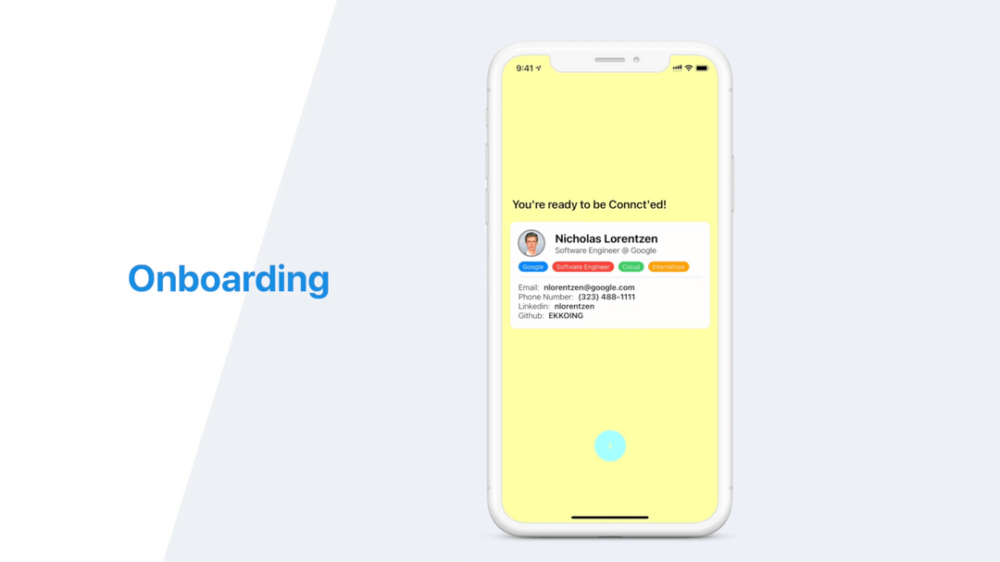

import { YouTube } from '@astro-community/astro-embed-youtube'

# ConnctMe

<YouTube id="DJWlZnFEFG0" />

_ConnctMe was presented at [Hack@Home 2020, where it won "Best Use of Google Cloud"](https://devpost.com/software/connctme)._

## Inspiration

Networking is hard, and COVID-19 has only made it harder. Keeping track of all of the people you've met and then remembering to follow up is exhausting. In the past, you could at least hand out your business card or copies of your resume to ensure that you're remembered, but social distancing has made that a thing of the past.

## What it does

ConnctMe provides an easy way for people to connect. After signing up, a user can create a profile with information such as their name, location, and resume. At a networking event, they can generate a QR code for connectors to scan and connect. This QR code will lead to this user's profile, displayed either on the app or as a webpage, depending on whether the connector has the app. As a user accumulates connections, they can also search or filter through their connections by date and event.

## How we built it

We built ConnctMe using SwiftUI with Cocoapods. We also used Google Cloud Firebase's Firestore to create a database and store information about each user.

## Challenges we ran into

Our team members are spread across two continents, so we faced many challenges communicating and keeping each other updated. In addition, none of our team members have used SwiftUI or Google Cloud before, so we had some difficulty with those.

## What we learned

We learned so much about SwiftUI, Xcode, and Google Cloud. Just as importantly, we learned that strong planning and communication are vital for any project, especially when working remotely.

## What's next for ConnctMe

We hope to incorporate more features to help users stay connected, such as reminding them to follow up with their new connections after an event or messaging past connections. In addition, we plan to further integrate ConnctMe with Google Cloud and eventually, to deploy ConnctMe on the App Store.

## Screenshots

